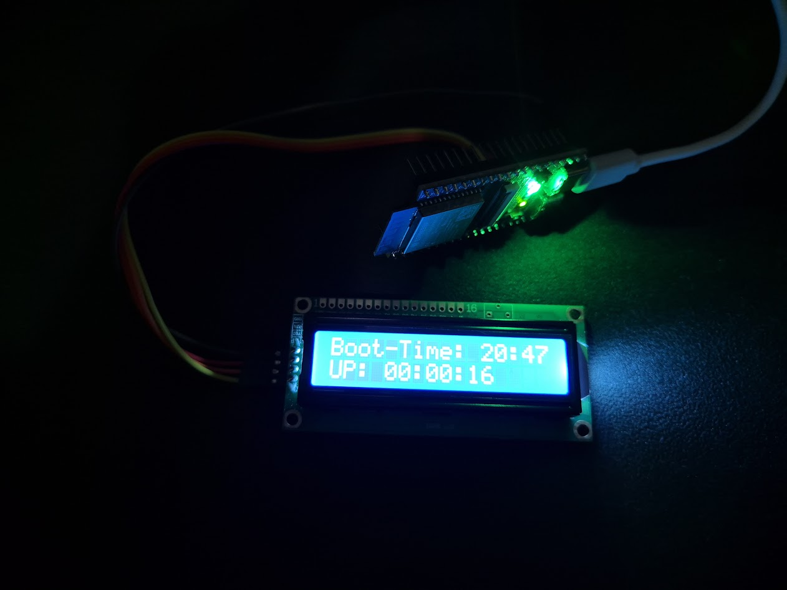

# esp32_wifi_monitor
This a 1 day project I made to monitor my network status as it drops out occationally.
I've used an ESP32S3 I had lying around with the arduino libraries as this is simplier than the espressif libraries and the saving in time is more valuable than the overheads.
It should also be noted that a lot of the libraries/code was copied as program memory was not a concern for this project as it's quite simple for an ESP32.
I initially started with a superloop approach but decided to switch to an RTOS in order to handle delays better and to prevent the ISR from exceeding the watchdog timeout.

## Features
The finished (for now) project has the following features:
* Network Status Monitoring (Pings Google DNS every 5s).
* Setup internal RTC using timeserver (refreshing once every 30min or when network is next avaliable).
* SD card logging in the format of `YYYY-MM-DD HH:MM:SS: ({RRT}ms|FAILED)`.
* LCD Display with the uC boot-time and current uptime/downtime in HH:MM:SS.
* Button with ISR to toggle LCD backlight.

## Image of Final Project

## Future Works?
* It may be nice adding to have some way of fetching the data from the ESP32 without removing the SD card. Potentially solutions include:
  * Uploading data to cloud.
  * Setting up ESP32 to act as WIFI AP and creating a protocol to fetch data.
  * Setting up ESP32 to act as a BLE device and fetching data that way.
* Data visualisation tool.
  * Currently the data is stored as a text file, it would be nice to have the data analysed and visualised.
  * Realtime? ✨
* Form-factor
  * The current project is just a ESP32-S3, a LCD1602 display (with a PCF8574AT GPIO I2C Expansion Chippie), and 4 wires. I might be nice having a dedicated PCB and housing for it.
* Net-Statistics
  * Currently the project just displays uptime/down - it'll be nice to have more stats like packet-loss, packet-jitter, averages, and deviations.
  * We're only pinging google DNS currently which is unlikely to be down (fine for this purpose) but if we care about the RRT then we should also ping other servers (e.g. cloudflare and ISP DNS).
* Code
  * I hacked together a bunch of code into one file as this is a very small project but may be worth refactoring and properly organising the code-base if I do more work here.

